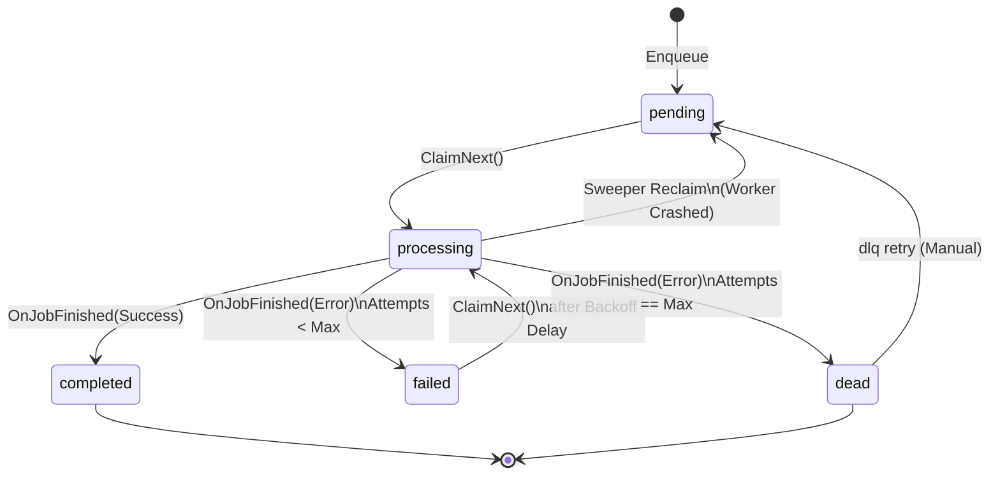
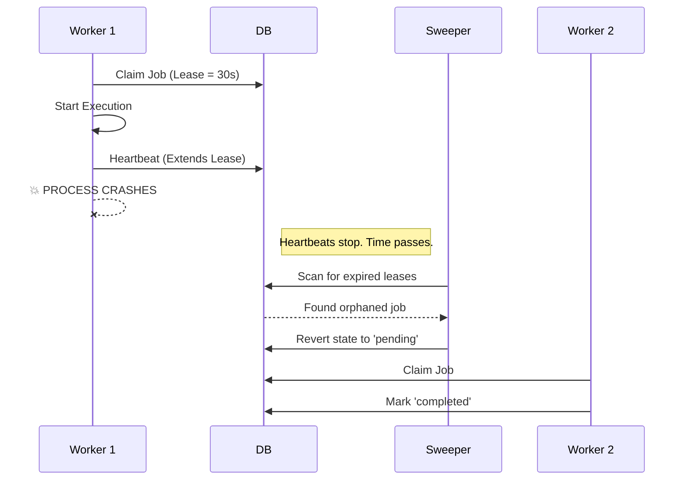

# QueueCTL: System Architecture and Internal Design

QueueCTL is a single-binary, embedded-storage, in-process background worker pool built in Go.

This document serves as the official architectural reference for QueueCTL. It explains the system from first principles, detailing not just *what* the system does, but *why* the design decisions were made, how concurrency is safely managed, and what trade-offs exist in the current architecture.

---

## 1. Introduction and First Principles

### The Problem: Asynchronous Processing
In modern software, systems must frequently execute tasks that are computationally expensive, time-consuming, or prone to network failure (e.g., sending emails, generating reports, processing video). Executing these synchronously blocks the main application thread, leading to timeouts and degraded user experience.

### The General Solution: Job Queues
The standard solution is to decouple the *request* from the *execution* using a **Job Queue**. The application creates a "job" (a record of work to be done) and places it in a persistent queue. Separate worker processes continuously poll this queue, claim jobs, execute them, and handle retries if failures occur.

Traditionally, this requires complex distributed infrastructure like Redis (Sidekiq), RabbitMQ (Celery), or Kafka. These introduce operational overhead, network latency, and deployment complexity.

### The QueueCTL Approach
QueueCTL provides the resiliency and concurrency of a distributed job queue **without the infrastructure overhead**. It operates entirely over an embedded SQLite database. Both the CLI for enqueuing jobs and the background worker daemons that process them are compiled into a single static binary.

This approach trades horizontal, multi-machine scalability for extreme operational simplicity, making it ideal for single-node deployments, edge devices, and localized task runners.

---

## 2. High-Level Architecture

QueueCTL is divided into three distinct layers to strictly separate concerns:

1. **Storage Layer (`store/`)**: Responsible for atomic state transitions, concurrency control, and persistent durability via SQLite.
2. **Core Domain (`core/`)**: Responsible for the business logic of a worker: polling, heartbeats, exponential backoff math, process execution, and lease sweeping.
3. **CLI & Routing (`cmd/`)**: The user interface. Spawns daemons, handles detached processes, and formats output.


---

## 3. Data Model & The State Machine

Every job in QueueCTL transitions through a strict, unidirectional state machine.

### State Definitions
- **`pending`**: The job is ready to be executed.
- **`processing`**: A worker has exclusively claimed the job and is currently executing it.
- **`completed`**: The job finished successfully. Terminal state.
- **`failed`**: The job encountered an error and is waiting in the backoff queue for a retry.
- **`dead`**: The job exhausted its maximum retries (Poison Pill) and requires manual intervention. Terminal state.

### State Transition Diagram



### Design Decision: 1-Indexed Attempts
In QueueCTL, the `attempts` counter represents the *real execution count*.
When a job is `pending`, attempts are `0/3`. The moment it is claimed by a worker, the counter increments to `1/3`. If the job succeeds, it finishes at `1/3`. If it fails, the next retry will increment it to `2/3`. This provides a highly intuitive representation of the job's lifecycle directly mirroring human logic, avoiding off-by-one confusion when defining `max_retries`.

---

## 4. Concurrency & Locking Strategy

### The Problem: The "Thundering Herd"
If 10 workers are running concurrently, they will all poll the database at the same time. If they all execute `SELECT * FROM jobs WHERE state = 'pending'`, they will all see the same job. If they all try to execute it, you get duplicated work and race conditions.

### The QueueCTL Solution: `BEGIN IMMEDIATE` + WAL Mode
QueueCTL solves this using SQLite's Write-Ahead Logging (WAL) and explicit immediate transactions.

1. **WAL Mode**: Enabled via `PRAGMA journal_mode=WAL`. This allows multiple readers to read from the database concurrently without blocking writers, drastically increasing throughput.
2. **Immediate Transactions**: When `ClaimNext()` is called, QueueCTL executes `BEGIN IMMEDIATE;`.
   - In SQLite, standard transactions (`DEFERRED`) only acquire a read lock until a write actually happens. This causes deadlocks (`SQLITE_BUSY`) when multiple workers read simultaneously and then all attempt to upgrade to a write lock.
   - `BEGIN IMMEDIATE` forces the worker to acquire the exclusive write lock *before* it even reads the row. If another worker holds the lock, SQLite utilizes the `busy_timeout(5000)` pragma to automatically queue and block the connection for up to 5 seconds before giving up.
3. **Atomic Claim**: The worker executes a single `UPDATE ... RETURNING` statement. The database guarantees that only one worker can successfully update the row to `processing`.

```sql
-- Atomic, exclusive claim mechanism
UPDATE jobs
SET state = 'processing', worker_id = ?, attempts = attempts + 1, ...
WHERE id = (
    SELECT id FROM jobs
    WHERE state IN ('pending', 'failed') AND available_at <= NOW()
    ORDER BY priority DESC, available_at ASC
    LIMIT 1
) RETURNING *;
```

### Trade-offs
Because SQLite only allows a single concurrent writer, the system's maximum throughput is bottlenecked by disk IO ops per second. While QueueCTL can safely coordinate hundreds of workers, the total throughput maxes out around a few thousand jobs per second. For single-node background processing, this is more than sufficient.

---

## 5. Resiliency & Fault Tolerance

QueueCTL is designed to assume that the underlying host machine, the network, and the worker processes will inevitably fail.

### 5.1 Crash Recovery & Leases
**The Problem**: A worker claims a job (setting state to `processing`), begins executing it, and then the process is killed (e.g., OOM kill, server restart, power failure). The job is now permanently stuck in `processing` because the worker isn't alive to mark it as `failed` or `completed`.

**The Solution: Lease Heartbeats**
When a worker claims a job, it is granted a **Lease** (default 30 seconds). 
While the worker executes the job, a separate background goroutine sends a "Heartbeat" to the database every 10 seconds, extending the `lease_expires` timestamp.

If the worker crashes, the heartbeats stop. A background **Sweeper** routine (running in the active workers) periodically scans the database for jobs stuck in `processing` where the `lease_expires` is in the past. It assumes the worker died, and forcefully reverts the job to `pending` so it can be reclaimed by a healthy worker.



### 5.2 Exponential Backoff
**The Problem**: Tasks often fail due to transient issues (e.g., a third-party API is temporarily down). Retrying immediately will likely result in another failure, wasting resources and spamming the broken API.

**The Solution**: QueueCTL calculates an exponential backoff delay based on the number of attempts: `Delay = Base^Attempts`.
If `backoff_base` is 2:
- Attempt 1 fails -> `2^1` = Wait 2 seconds.
- Attempt 2 fails -> `2^2` = Wait 4 seconds.
- Attempt 3 fails -> `2^3` = Wait 8 seconds.

This gives external systems time to recover before the next execution. The job is marked as `failed`, and its `available_at` timestamp is pushed into the future. `ClaimNext()` explicitly ignores jobs where `available_at` is greater than the current time.

### 5.3 Dead Letter Queue (DLQ)
**The Problem**: A "Poison Pill" is a job that will *never* succeed (e.g., a malformed command, a permanent 404 error). Retrying it infinitely wastes worker CPU and clogs the queue.

**The Solution**: When a job hits `MaxRetries`, it is banished to the Dead Letter Queue (State: `dead`). It is completely ignored by the worker pool. Engineers can inspect the DLQ via `queuectl dlq list`, read the exact `stderr` output that caused the failure, fix the underlying issue, and manually re-insert it into the queue via `queuectl dlq retry <job_id>`.

---

## 6. Execution Model and Cross-Platform Design

QueueCTL can spawn workers in the foreground or as detached background daemons.

### Detached Process Spawning
When a user runs `queuectl worker start --detach`, the CLI forks a child process using `os/exec` pointing to its own executable binary (`queuectl worker run --id <generated>`). The parent process records the child's PID into `~/.queuectl/workers.pid` and immediately exits, leaving the daemon running in the OS background.

### Cross-Platform Liveness Checking
To determine if these detached workers are still actively running (for `queuectl status` or `queuectl worker stop`), the system reads the PID file and checks OS-level process health.

**The Challenge**: Unix systems (Linux/macOS) allow you to send a "0" signal (`syscall.Signal(0)`) to check if a process is alive. Windows does not support this and will unconditionally return an error.

**The Solution**: QueueCTL implements a runtime OS check:
- On **Unix**, it utilizes native POSIX signal checking.
- On **Windows**, it delegates to the native `tasklist /FI "PID eq <pid>"` utility, parsing the output to ensure the process exists.

Furthermore, because Windows cannot gracefully handle `SIGTERM` signals sent between independent processes, the CLI smartly falls back to a hard `process.Kill()` on Windows if graceful termination is unsupported, ensuring deterministic teardown.

---

## 7. Future Considerations

While QueueCTL is highly robust for its scope, future engineers should be aware of its architectural boundaries:

1. **Distributed Workers**: Because QueueCTL relies on a local SQLite file, you cannot spin up workers on multiple physical machines (unless using a shared network drive, which ruins SQLite WAL performance and introduces severe latency/locking issues). If horizontal machine scaling is required, the `store.Store` interface must be re-implemented to use Redis or PostgreSQL.
2. **Prioritization**: Currently, jobs are ordered strictly by `priority DESC, available_at ASC`. While effective, high-priority jobs can perpetually starve low-priority jobs in a saturated queue. Future iterations could implement fair-share queuing or dedicate specific workers to specific priority bands.
3. **Log Rotation**: Job records are currently kept forever. A cron-like feature within the Sweeper daemon should eventually be added to prune `completed` jobs older than 7 days to prevent SQLite bloat.
